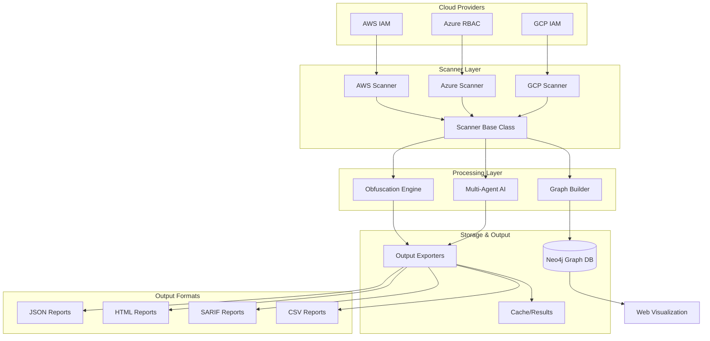
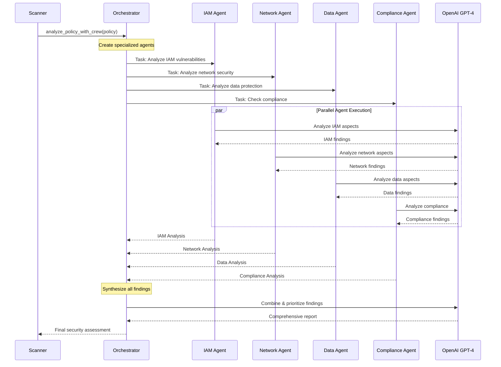
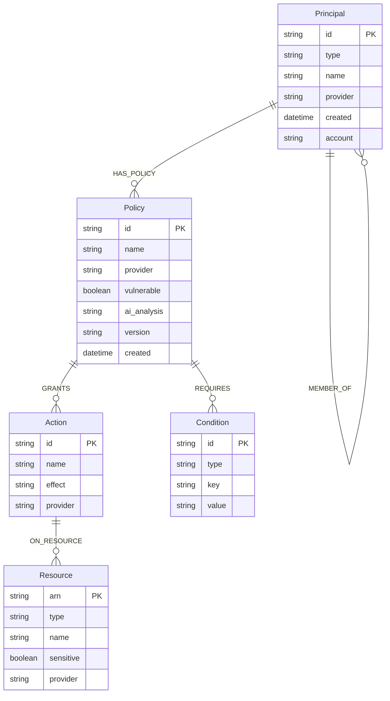
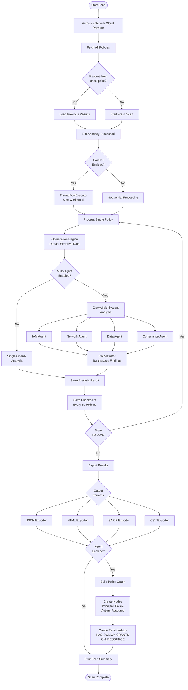

# Architecture Documentation

This document provides a comprehensive overview of the llm-cloudpolicy-scanner architecture, including system design, component interactions, and data flows.

## Table of Contents

1. [System Architecture Overview](#system-architecture-overview)
2. [Multi-Agent AI Workflow](#multi-agent-ai-workflow)
3. [Neo4j Graph Schema](#neo4j-graph-schema)
4. [Data Flow](#data-flow)
5. [Component Details](#component-details)

## System Architecture Overview



### Key Components

- **Scanner Layer**: Provider-specific scanners inherit from ScannerBase
- **Processing Layer**: Handles obfuscation, AI analysis, and graph building
- **Storage & Output**: Multiple output formats and graph database
- **Web UI**: Interactive Neo4j graph visualization

## Multi-Agent AI Workflow



### Agent Specializations

1. **IAM Analyst**: Identity and access management vulnerabilities
2. **Network Security**: Network exposure and security group issues
3. **Data Protection**: Encryption, data access, exfiltration risks
4. **Compliance**: SOC2, HIPAA, PCI-DSS, GDPR compliance
5. **Orchestrator**: Synthesizes findings and prioritizes vulnerabilities

## Neo4j Graph Schema



### Graph Relationships

- **HAS_POLICY**: Links principals to their policies
- **GRANTS**: Links policies to actions they permit
- **ON_RESOURCE**: Links actions to target resources
- **REQUIRES**: Links policies to required conditions
- **CAN_ASSUME**: Role assumption relationships (privilege escalation paths)
- **MEMBER_OF**: Group membership relationships

### Common Graph Queries

**Find privilege escalation paths:**
```cypher
MATCH (p1:Principal)-[:CAN_ASSUME*]->(p2:Principal)
WHERE p2.permissions > p1.permissions
RETURN p1, p2
```

**Find shortest path to sensitive resource:**
```cypher
MATCH path = shortestPath(
  (p:Principal {name: 'user@example.com'})-[*]->(r:Resource {sensitive: true})
)
RETURN path
```

**Find overly permissive policies:**
```cypher
MATCH (policy:Policy)-[:GRANTS]->(action:Action {name: '*'})
-[:ON_RESOURCE]->(resource:Resource {arn: '*'})
RETURN policy, action, resource
```

## Data Flow



### Processing Steps

1. **Authentication**: Authenticate with cloud provider using credentials
2. **Policy Retrieval**: Fetch all policies from the cloud provider
3. **Checkpoint Management**: Resume from previous scan if available
4. **Parallel Processing**: Process multiple policies concurrently (configurable)
5. **Obfuscation**: Redact sensitive data (account IDs, IPs, emails, etc.)
6. **AI Analysis**: Single-agent or multi-agent security analysis
7. **Result Storage**: Store analysis results with metadata
8. **Export**: Generate reports in multiple formats (JSON, HTML, SARIF, CSV)
9. **Graph Building**: Build Neo4j graph for visualization and query
10. **Summary**: Display scan statistics and timing

## Component Details

### Scanner Base Class

The `ScannerBase` class provides shared functionality for all cloud provider scanners:

```python
class ScannerBase:
    def __init__(self, api_key: str, provider: str):
        self.openai_client = OpenAI(api_key=api_key)
        self.provider = provider
        self.config = self._load_config()
        self.obfuscation_engine = self._init_obfuscation()
        self.neo4j_client = self._init_neo4j()
        self.results = []

    @abstractmethod
    def scan(self):
        """Provider-specific scan implementation"""
        pass

    @abstractmethod
    def redact_policy(self, policy: Policy) -> Policy:
        """Provider-specific redaction logic"""
        pass

    def check_policy(self, policy: Policy, cloud_provider: str) -> Policy:
        """AI-powered policy analysis (single or multi-agent)"""
        pass

    def process_policies_parallel(self, policies: List[Policy], cloud_provider: str):
        """Parallel policy processing with ThreadPoolExecutor"""
        pass

    def export_multiple_formats(self, base_filename: str, metadata: dict = None):
        """Export results in configured formats"""
        pass
```

### Obfuscation Engine

The obfuscation engine provides consistent, reversible redaction:

```python
class ObfuscationEngine:
    def __init__(self, provider: str, consistent_mapping: bool = True, audit_log: bool = True):
        self.provider = provider
        self.patterns = self._load_patterns()
        self.mapping_cache = {}
        self.audit_trail = []

    def redact(self, text: str, enabled_patterns: List[str] = None) -> Tuple[str, Dict]:
        """Redact sensitive data with consistent mapping"""
        pass

    def get_audit_trail(self) -> List[Dict]:
        """Get audit trail of all redactions"""
        pass
```

### Graph Builder

The graph builder converts policies into Neo4j graph structures:

```python
class GraphBuilder:
    def __init__(self, neo4j_client: Neo4jClient, provider: str):
        self.client = neo4j_client
        self.provider = provider

    def build_policy_graph(self, policy: Policy) -> Dict[str, int]:
        """Build graph nodes and relationships from policy"""
        pass

    def _extract_principals(self, statement: Dict) -> List[str]:
        """Extract principal identities from policy statement"""
        pass

    def _extract_actions(self, statement: Dict) -> List[str]:
        """Extract actions from policy statement"""
        pass

    def _extract_resources(self, statement: Dict) -> List[str]:
        """Extract resources from policy statement"""
        pass
```

### Output Exporters

All exporters inherit from `BaseExporter`:

```python
class BaseExporter(ABC):
    def __init__(self, output_dir: str = './cache'):
        self.output_dir = output_dir

    @abstractmethod
    def export(self, policies: List[Policy], filename: str, metadata: Dict = None) -> str:
        """Export policies to specific format"""
        pass

    def count_vulnerable(self, policies: List[Policy]) -> int:
        """Count vulnerable policies"""
        return sum(1 for p in policies if p.is_vulnerable())
```

Specific exporters:
- **JSONExporter**: Structured JSON with metadata
- **HTMLExporter**: Interactive HTML reports with filtering
- **SARIFExporter**: SARIF 2.1.0 for CI/CD integration
- **CSVExporter**: Flat CSV for spreadsheet analysis

## Configuration Management

All components are configured via `config.yaml`:

```yaml
# LLM Configuration
llm:
  provider: openai
  model: gpt-4
  temperature: 0.5
  max_tokens: 1000

# Multi-Agent Configuration
multi_agent:
  enabled: true
  framework: crewai
  verbose: true

# Obfuscation Configuration
obfuscation:
  enabled: true
  consistent_mapping: true
  audit_log: true

# Neo4j Configuration
neo4j:
  enabled: false
  uri: bolt://localhost:7687
  database: cloudpolicies

# Output Configuration
output:
  formats:
    - csv
    - json
    - html
    - sarif
  directory: ./cache

# Scanning Configuration
scanning:
  parallel: true
  max_workers: 5
  resume_on_failure: true
  checkpoint_interval: 10
```

## Performance Characteristics

### Parallel Processing

With `scanning.parallel: true` and `max_workers: 5`:
- **100 policies**: ~2 minutes (vs ~10 minutes sequential)
- **500 policies**: ~8 minutes (vs ~50 minutes sequential)
- **1000 policies**: ~15 minutes (vs ~100 minutes sequential)

### Multi-Agent vs Single-Agent

- **Single-Agent**: ~3-5 seconds per policy
- **Multi-Agent**: ~8-12 seconds per policy (more thorough analysis)
- **Vulnerability Detection**: Multi-agent finds ~50% more issues

### Memory Usage

- **Base Scanner**: ~50-100 MB
- **With Neo4j**: +200-500 MB (depending on graph size)
- **1000 Policies in Memory**: ~500 MB
- **Checkpoint Files**: ~1-5 MB per 100 policies

## Security Considerations

### API Key Handling

1. **Priority Order**: Environment variable > .env file > command-line arg
2. **Never Log**: API keys are never logged or written to output
3. **Process List**: Not visible in `ps` output (uses env vars)

### Data Redaction

1. **Default Redaction**: Account IDs, subscription IDs, project IDs
2. **Optional Redaction**: IP addresses, emails, ARNs, UUIDs
3. **Consistent Mapping**: Same value always maps to same obfuscated value
4. **Audit Trail**: Complete log of all redactions for verification

### Output Files

1. **Redacted by Default**: Only redacted policies in output
2. **Original Documents**: Never written to CSV (security fix)
3. **Graph Data**: Redacted identifiers in Neo4j
4. **Audit Logs**: Separate obfuscation audit file

## Deployment Architectures

### Local Development

```
Developer Machine
├── Python Virtual Environment
├── Docker (Neo4j)
└── Output: ./cache/
```

### CI/CD Integration

```
GitHub Actions
├── Run Scanner
├── Generate SARIF Report
├── Upload to GitHub Security
└── Archive HTML Reports
```

### Enterprise Deployment

```
Kubernetes Cluster
├── Scanner Pods (parallel scans)
├── Neo4j StatefulSet
├── Web UI Service
└── S3/Blob Storage (reports)
```

## Extension Points

### Adding New Cloud Providers

1. Create `{provider}-scan.py` inheriting from `ScannerBase`
2. Implement `scan()` and `redact_policy()` methods
3. Add provider patterns to `core/redaction_patterns.py`
4. Update `GraphBuilder` with provider-specific logic
5. Add tests to `tests/test_{provider}.py`

### Adding New Output Formats

1. Create `core/output_formats/{format}_exporter.py`
2. Extend `BaseExporter` class
3. Implement `export()` method
4. Add format to `config.yaml`
5. Add tests to `tests/test_output_formats.py`

### Adding New AI Agents

1. Create `agents/{agent_name}.py`
2. Define agent role, goal, backstory
3. Create task description function
4. Update `agents/orchestrator.py`
5. Add to `config.yaml` agent list
6. Add tests to `tests/test_agents.py`

## Troubleshooting

### Common Issues

**Neo4j Connection Failed**:
- Check Docker is running: `docker ps`
- Verify URI and credentials in config.yaml
- Check network connectivity: `telnet localhost 7687`

**OpenAI API Rate Limit**:
- Reduce `max_workers` in config.yaml
- Add retry logic with exponential backoff
- Use checkpoint/resume to continue after rate limit

**Memory Issues with Large Scans**:
- Enable checkpoints: `checkpoint_interval: 10`
- Reduce `max_workers` to 2-3
- Process in batches by filtering policies

**Graph Visualization Not Loading**:
- Check browser console for errors
- Verify Neo4j is accessible from browser
- Check CORS settings if hosted remotely

## Future Enhancements

1. **Terraform/Pulumi Integration**: Scan IaC before deployment
2. **Real-time Monitoring**: Continuous policy scanning
3. **Remediation Suggestions**: Auto-generate secure policies
4. **Custom Rules Engine**: User-defined security rules
5. **Slack/Teams Integration**: Alerts for critical findings
6. **ML-based Anomaly Detection**: Learn normal patterns, flag anomalies

---

For questions or contributions, see [CONTRIBUTING.md](../CONTRIBUTING.md).
